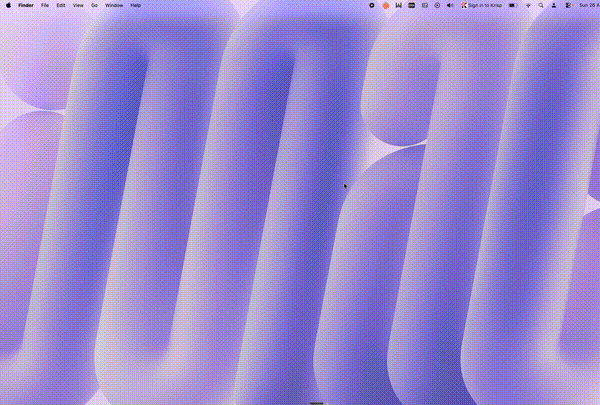

<p align="center">
  
</p>

<h1 align="center">Whip Me Bad</h1>

<p align="center">
  <sub>Your AI just got a little spicier</sub>
</p>

<p align="center">
  <a href="https://github.com/heynaavi/Whip-Me-Bad/releases/latest"></a>
  <a href="https://www.npmjs.com/package/whip-me-bad"></a>
  
  
</p>

<br>

<p align="center">
  
</p>

<br>

A dreamy neon whip cracks across your screen — with a satisfying slap — every time you press Enter or your AI does something.

---

### Install

```bash
npm install -g whip-me-bad && whip-me-bad
```

Or grab the app → [macOS `.dmg`](https://github.com/heynaavi/Whip-Me-Bad/releases/latest) · [Windows `.exe`](https://github.com/heynaavi/Whip-Me-Bad/releases/latest)

---

### How it works

| | |
|:--|:--|
| 🍑 **Enter key** | Press Enter anywhere. Get whipped. |
| 🔗 **Kiro** | Hooks auto-install. Fires on prompts · edits · tasks · agent stop. |
| 🔥 **Streaks** | Mash Enter. Phrases escalate. |
| ⚙️ **Menu bar** | Pause · volume · custom sounds · custom hotkey · insights. |

---

### Streaks & Personas

<table>
<tr>
<td>

| Hits | |
|:-----|:--|
| 1–2 | *spank that code* |
| 3–5 | *HARDER, FASTER* |
| 6–9 | *right there* |
| 10–14 | *ALMOST THERE* |
| 15+ | *SHIPPED 🚀* |

</td>
<td>

| Whips | |
|:------|:--|
| 0 | 🥚 Fresh Egg |
| 50 | 🍑 Cheeky One |
| 100 | ⚡ Speed Demon |
| 250 | 🔥 Clanker |
| 1000 | 👑 Whip Royalty |

</td>
</tr>
</table>

---

### Contribute

The app listens on `localhost:31338/whip` — any tool that can hit that endpoint works.

| IDE | Status |
|:----|:-------|
| [Kiro](https://kiro.dev) | ✅ Auto-installed |
| Cursor · Windsurf · VS Code | 🔲 PRs welcome |

Want to help? → animations · sound packs · Linux · more IDEs

---

### Build from source

```bash
git clone https://github.com/heynaavi/Whip-Me-Bad.git
cd Whip-Me-Bad && npm install && npm start
```

Package: `npm run build` (macOS) · `npm run build:win` (Windows) · `npm run build:all` (both)

---

### Roadmap

- [x] Neon whip + audio
- [x] Kiro hooks
- [x] Streak mode
- [x] Menu bar + custom sounds/hotkey
- [x] Cinematic onboarding
- [x] Insights + personas
- [x] Windows
- [ ] More IDEs
- [ ] Linux
- [ ] Sound packs

---

<p align="center">
  Inspired by <a href="https://github.com/GitFrog1111/OpenWhip">OpenWhip</a>
  <br>
  <sub>MIT · built with love and questionable judgment 🍑</sub>
</p>
